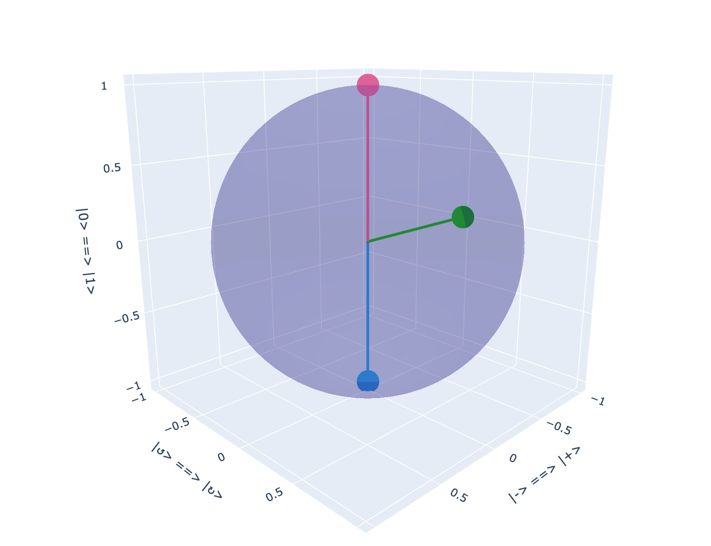

# qsharp-learning

量子编程学习。

## 内容包括

### 课程

* [MIT18-435j量子编程课程](./course/mit-open-course/sites/18-435j-fall-2003/ReadMe.txt)

### 电子书

> 注意：以下图书仅限学习使用。

* Mastering Quantum Computing with IBM QX

### `qctools`

`qctools`基于`numpy`和`plotly`实现的一个简单地用于自学的模块。

#### 安装依赖

```bash
cd /directory/to/qsharp-learning
poetry install
```

#### 基本教程

可以基于字符串来实现多量子比特定义，譬如 $\left| 01+↺ \right>$ 表示为`ket("O1+<")`。具体的映射表如下：

|符号|代码|
|:---:|:---:|
|$0$|`"0"`|
|$1$|`"1"`|
|$+$|`"+"`|
|$-$|`"-"`|
|$↺$|`"<"`|
|$↻$|`">"`|

还有简单地绘制多个量子比特的函数：

```python
from qctools import (
    plot_bloch_for_qubits as plt,
    get_bloch_coordinates,
    const as c,
    op as o,
    ket,
    bra
)

plt([ket("1"), ket("0"), c.S @ ket(">")])
```

可以直接跳转浏览器画出如下图案:




如果需要在`jupyter`中使用，则可以使用如下语句：

```python
from plotly.offline import init_notebook_mode

init_notebook_mode()
```

#### 初始常量

可以直接从`qctools.const`中引用，比如

```python
import qctools.const as c
from qctools import ket

c.X @ ket("+")
```

|类型|符号|代码|
|:---:|:---:|:---:|
|一元门|$H$|`H`/`HADAMARD`|
|一元门|$X$|`X`/`SIGMA_X`|
|一元门|$Y$|`Y`/`SIGMA_Y`|
|一元门|$Z$|`Z`/`SIGMA_Z`|
|一元门|$S$|`S`|
|一元门|$T$|`T`|
|一元门|$S^{\dagger}$|`S_DRAGGER`|
|一元门|$T^{\dagger}$|`T_DRAGGER`|
|二元门|$CNOT$|`CNOT`|

## LICENSE

MIT License

Copyright (c) 2020 Huang Baochen

Permission is hereby granted, free of charge, to any person obtaining a copy
of this software and associated documentation files (the "Software"), to deal
in the Software without restriction, including without limitation the rights
to use, copy, modify, merge, publish, distribute, sublicense, and/or sell
copies of the Software, and to permit persons to whom the Software is
furnished to do so, subject to the following conditions:

The above copyright notice and this permission notice shall be included in all
copies or substantial portions of the Software.

THE SOFTWARE IS PROVIDED "AS IS", WITHOUT WARRANTY OF ANY KIND, EXPRESS OR
IMPLIED, INCLUDING BUT NOT LIMITED TO THE WARRANTIES OF MERCHANTABILITY,
FITNESS FOR A PARTICULAR PURPOSE AND NONINFRINGEMENT. IN NO EVENT SHALL THE
AUTHORS OR COPYRIGHT HOLDERS BE LIABLE FOR ANY CLAIM, DAMAGES OR OTHER
LIABILITY, WHETHER IN AN ACTION OF CONTRACT, TORT OR OTHERWISE, ARISING FROM,
OUT OF OR IN CONNECTION WITH THE SOFTWARE OR THE USE OR OTHER DEALINGS IN THE
SOFTWARE.
